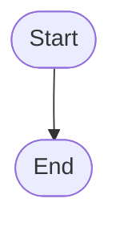
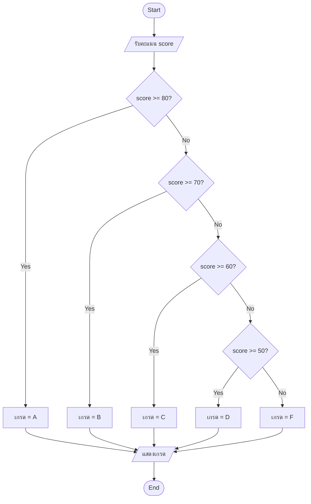
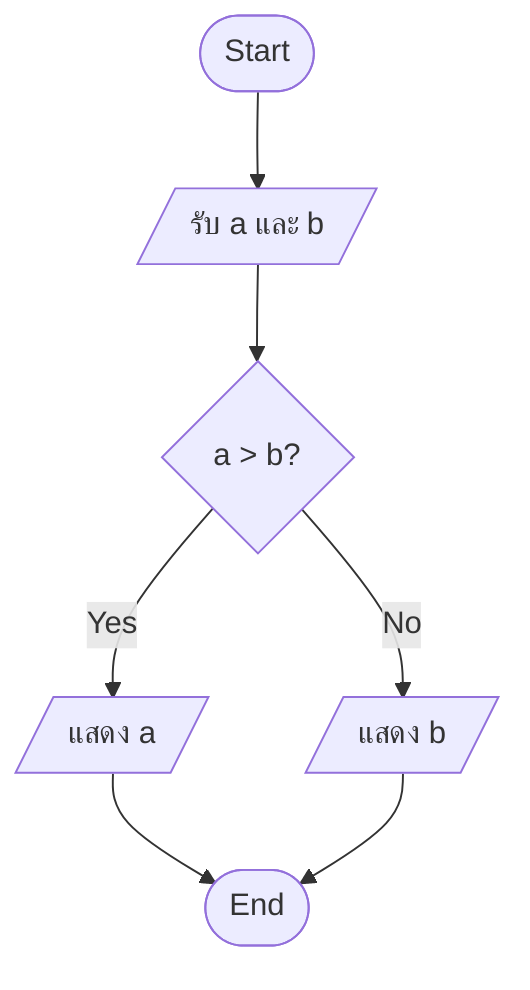
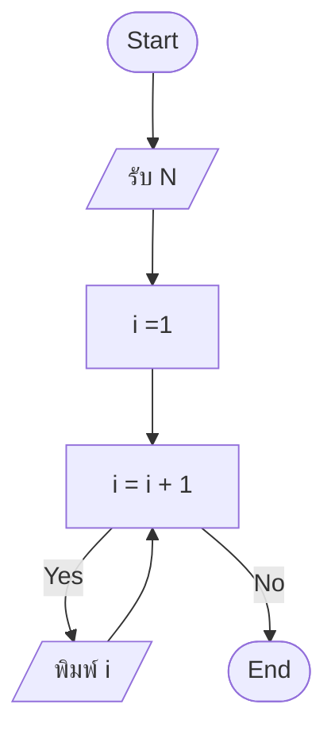

```mermaid
flowchart TD
 A([Start]) --> B([End])
```

```mermaid
                                                                                                                                                                                                                                                                                                                                                      flowchart TD
 Start([Start]) --> Input[/รับคะแนน score/]
 Input --> D1{score >= 80?}
 D1 -->|Yes| A[เกรด = A]
 D1 -->|No| D2{score >= 70?}
 D2 -->|Yes| B[เกรด = B]
 D2 -->|No| D3{score >= 60?}
 D3 -->|Yes| C[เกรด = C]
 D3 -->|No| D4{score >= 50?}
 D4 -->|Yes| D[เกรด = D]
 D4 -->|No| F[เกรด = F]
 A & B & C & D & F --> Output[/แสดงเกรด/]
 Output --> End([End])
```

```mermaid
                                                                                                                                                                                                                                                                                                                                                      flowchart TD
 Start([Start]) --> Input[/รับ a และ b /]
 Input --> D1{a > b?}
D1 -->|Yes| A[/แสดง a /]
D1 -->|No| B[/แสดง b /]
 A & B--> End([End])


 
```

```mermaid
flowchart TD
Start([Start])  --> K1[/รับ N/]
K1 -->A1[ i =1 ]
A1 --> D1{i <= N?}
D1--> |Yes| L1[/พิมพ์ i /]
L1 -->D1[ i = i + 1 ]
D1--> |No| End([End])

```
