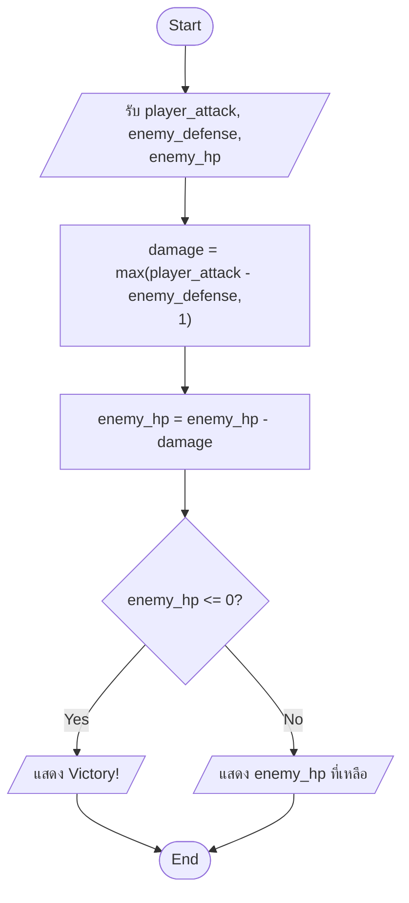
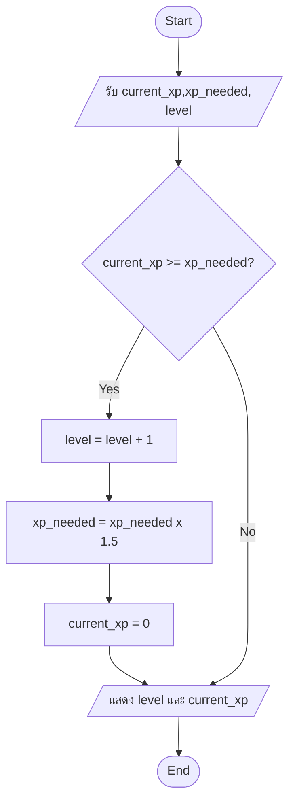

```mermaid

```

```mermaid

```

```mermaid
flowchart TD
Start([Start]) --> Input[/รับ player_attack, enemy_defense,
enemy_hp/]
Input --> Calc["damage = max(player_attack - enemy_defense,
1)"]
Calc --> Reduce["enemy_hp = enemy_hp - damage"]
Reduce --> D1{enemy_hp <= 0?}
D1 -->|Yes| Win[/แสดง Victory!/]
D1 -->|No| Show[/แสดง enemy_hp ที่เหลือ/]
Win & Show --> End([End])
```

```mermaid
flowchart TD
Start([Start]) --> Input[/รับ current_xp,xp_needed,
level/]
Input --> D1{current_xp >= xp_needed?}
D1 -->|Yes| D2[level = level + 1]
D2 --> D3[xp_needed = xp_needed x 1.5]
D3 --> D4[current_xp = 0]
D4 --> Show
D1 -->|No| Show[/แสดง level และ current_xp/]
Show --> End([End])
```
